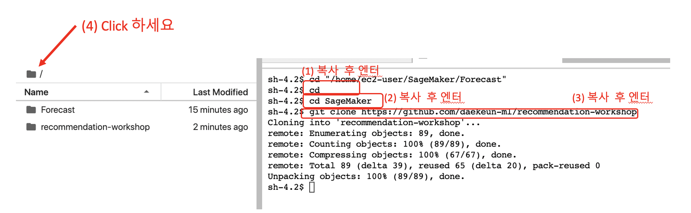

# 핸즈온 준비 단계 입니다.- Cloud Formation(CF) 을 통한 방법

# 1. 이벤트 엔진 접속 (Event Engine Access)
- 이벤트 엔진으로 접속이 아닐시에는 "2. CloudFormation Template을 사용하여 세이지 메이커 노트북 생성 및 권한 할당" 에서 시작 해주세요. (Skip this section if you don't use the event engine)
- 이벤트 엔진(https://dashboard.eventengine.run)에 접속을 하시고, 받으신 해시 코드를 입력해주세요. (Connect to the event engine and enter the hashcode given)

- 로그인 이후에 아래 "AWS Console"을 클릭 합니다. (Click AWS Console)

- AWS Console Login 이후에 "Open AWS Console"을 클릭 하세요. (Click "Open AWSConsole")

**아래 가이드는 Forecast (및 Personalize) 핸즈온 실습을 위해서 필요한 환경 구성을 합니다.
주요하게 세이지 메이커 노트북 인스턴스 생성, Forecast Git 코드 복사, 역할(Role) 생성 및 권한 생성 등을 합니다.**

# 2. CloudFormation Template을 사용하여 세이지 메이커 노트북 생성 및 권한 할당

## Building Your Environment

아래 작업은 CloudFormation Template을 구성하는 작업 입니다. 
### (1) 인터넷 브라우저(크롬, 파이어폭스 권장) 를 하나 더 여시고, AWS Account로 로긴하세요.
### (2) 이후에 브라우저에 안에서 새로운 탭을 하나 생성 후에, 아래 링크를 클릭하여 CloudFormation을 통해 관련 작업을 수행 하시면 됩니다. 
The first step is to deploy a CloudFormation template that will perform much of the initial setup for you. In another browser window login to your AWS account. Once you have done that open the link below in a new tab to start the process of deploying the items you need via CloudFormation.

### 아래 스크린샷의 가이드를 따라 하시면 됩니다. 
Follow along with the screenshots if you have any questions about these steps.

### Cloud Formation Wizard

**"Next" 버튼을 눌러서 진행 하십시오.** 
Start by clicking `Next` at the bottom like shown:

**'Next'버튼을 클릭 해주세요.**  
click `Next` again.

**스크롤을 맨 밑까지 하신 후에 'Next' 클릭 해주세요.**  
This page is a bit longer so scroll to the bottom to click `Next`.

**맨 밑까지 스크롤 하신 후에 체크 박스 클릭(새로운 IAM 리소스 생성 관련) 해주세요.
이후에 'Create Stack'클릭 해주세요.** 
Again scroll to the bottom, check the box to enable the template to create new IAM resources and then click `Create Stack`.

**2-3분 후에 CloudFormation은 세이지 메이커 노트북 인스턴스, S3 버킷, 역할(Role) 등을 생성합니다.** 
For a few minutes CloudFormation will be creating the resources described above on your behalf it will look like this while it is provisioning:

**이 작업이 끝난 후에 녹색 글씨로 완료 되었다는 글이 보이실 겁니다. 만약 빨간색으로 Error 가 기술되어 있으면 에러 메세지를 확인 바랍니다.** 
Once it has completed you'll see green text like below indicating that the work has been completed:

## 세이지 메이커 노트북 열기
Using the Notebooks

**콘솔의 왼쪽 상단의 네비게이션 바에서 'Services'를 클릭 하신 후에 'SageMaker'를 찾으세요.** 
Start by navigating to the SageMaker serivce page by clicking the `Services` link in the top navigation bar of the AWS console.

**'SageMaker'를 입력하고, 서비스가 보이시면 클릭하세요.** 
이후에 **서비스 페이지로 부터 왼쪽 메뉴에 'Notebook Instances' 링크를 클릭 하세요.** 
In the search field enter `SageMaker` and then click for the service when it appears, from the service page click the `Notebook Instances` link on the far left menu bar.

**노트북 인스턴스의 끝에 'Open JupyterLab'을 클릭하세요.** 
To get to the Jupyter interface, simply click `Open JupyterLab` on the far right next to your notebook instance.

- **소스가 있는 Git Repository를 복사하기 위해서, 상단 메뉴의 Git을 클릭하고, 이어서 "Open Terminal in Git Repository"를 클릭 해주세요.**

# Personalize 핸즈온 수행시만 진행
## Personalize Git Repository 주소
    
- Hands On Lab: Amazon Personalization
    - https://github.com/daekeun-ml/recommendation-workshop

### 퍼스널라이즈 Git Repository 다운로드 

- **아래 화면 처럼 입력 해주시고, 오른쪽에 폴더가 생성되었는지 확인 해주세요. (아래 그림의 (1), (2), (3)을 하세요)**
    - 간단하게 아래를 순서대로 카피 하시고 (Control-v 혹은 Cmd-v) 하시고 붙여넣기 (Control-v) 하시면 됩니다.
    - cd SageMaker
    - git clone https://github.com/daekeun-ml/recommendation-workshop

# 준비 완료 (Get Ready)

- 핸즈온의 준비가 완료 되었습니다. 만일 이 과정이 완료가 안되었으면 진행자에게 알려 주세요.

## After the Notebooks
작업이 끝나면, 앞에서 CloudFormation으로 생성한 stack을 지워야 합니다.다시 AWS 콘솔을 클릭하시고, 입력란에 'CloudFormation'을 입력하시고
메뉴가 보이시면 클릭하세료.  
Once you have completed all of the work in the Notebooks and have completed the cleanup steps there as well, the last thing to do is to delete the stack you created with CloudFormation. To do that, inside the AWS Console again click the `Services` link at the top, and this time enter in `CloudFormation` and click the link for it.

전에 생성한 demo stack 위에 'Delete' 버튼을 클릭 해주세요.  
Click the `Delete` button on the demo stack you created:

팝업 메뉴에 'Delete Stack'을 클릭 해주세요.  
Lastly click the `Delete Stack` button that shows up on the popup:

보이는 것럼 지워지고 있다는 것을 알 수 있을 겁니다. 'Delete Completed'가 보이면 모든 작업이 완료 된 것 입니다. 수고 하셨습니다.  
You'll now notice that the stack is in progress of being deleted. Once you see `Delete Completed` you know that everything has been deleted and you are 100% done with this lab.

